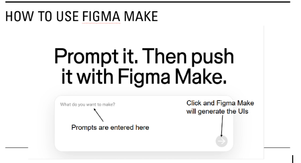
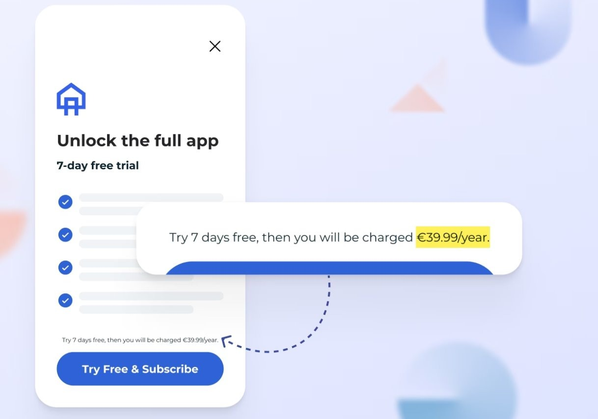

## Study Procedure
#### Screening Survey
**Consent form**
1. What is your age? 
    (A) <18 (B) 18-25 (C) 26-35 (D) 36-45 (E) 46-60 (F) 60+
2. What is your experience with UI design? 
	(A) No experience (B) Less than 1 year (C) 1-2 years (D) 3-5 years (E) More than 5 years
3. What is your experience with AI-powered UI design tools (e.g., Figma Make)? 
    	(A) No experience (B) Less than 1 year (C) More than 1 year  
[If “<18” to Q1 or “no experience” to Q2 or Q3, quit the survey and thank the participant]  
4. What is your gender identity? 
	(A) Male (B) Female (C) Non-binary (D) Prefer not to say
5. What is the highest level of education you have completed? 
(A) Some high school or less (B) High school diploma or GED  
(C) Some college, but no degree (D) Associates or technical degree 
(E) Bachelor’s degree  
(F) Graduate or professional degree (MA, MS, MBA, PhD, JD, MD, DDS, etc.) 
(G) Prefer not to say
6. What AI-powered UI design tool(s) have you used? [open text box]  
7. Are you able to participate in the study via Zoom (audio and screen sharing required; video optional)? 
	(A) yes (B) no
8. Thanks very much for your interest in our study. We will contact you to schedule the study. Please enter an email address by which we can contact you. [open text box]  
9. If you have any other questions or information, please enter them here. [open text box]  

#### Welcome message
- Introduce the researchers

**What we’ll do:**
- Ask brief questions about your UI design background.​
- Give you two design tasks to complete in Figma Make.​
- Ask follow-up questions about your tasks.​
- Complete the follow-up survey after the interview.​

**Please note:**
- There is no right or wrong. We will not evaluate your design. Our goal is to understand your perceptions and practices.
- Feel free to ask questions at any time.​

#### Background Questions
1. How many years of experience do you have in UI/UX design?
2. What is the size of your company or team? What is your role?
3. What types of interfaces do you primarily design (web, mobile apps, or multiple platforms)?
4. Which non-AI UI design tools do you usually work with (e.g., Figma)?
5. What AI-powered UI generation tools (e.g., Figma Make, Lovable, Vercel V0) do you use? 

#### Task Description
Please imagine you are asked to design several UIs, and complete the following two UI design tasks in Figma Make.​

**Reminder: There’s no right or wrong.**

#### Introducing Figma Make

Please use this account to access Figma Make​
- Website: https://www.figma.com/make/ ​
- Account: ​
- Password:​

#### Display Two Tasks

#### Post Task Questions
1. How do you feel about the UI that was generated? 
2. How would you describe the overall user experience of this UI? 
3. What considerations did you have in mind when designing this prompt? 

#### DP-related Questions
1. Have you heard of the term dark patterns?
a. [if yes, continue; if not, explain what the DP is]

Definition of Dark Pattern:  
“Dark patterns are used in websites and apps that make users do things that they didn't intend to”

 2. Did you notice any dark patterns in the UI design?
- a. If yes, what were they?
- b. If no or unsure, [explain which part of the UI is DP], what are your thoughts on this?
 3. Why do you think the dark pattern(s) appeared in the design?
 4. Which part of the prompts would you think will result in a dark pattern?
 5. What are your thoughts on the presence of such dark patterns?
 6. How do you think users would react to these dark patterns? 
 7. How do you think your company or your team would view these dark patterns?
 8. Should these dark patterns be kept or removed? Why?
- a. [if removed] How to improve the prompt to avoid these dark patterns? Are there other ways (technical or non-technical, within or outside Figma) to avoid these dark patterns?

#### Post-interview Survey
Thank you very much for your participation. We have a few additional UI design tasks for which we’d like to collect your prompts. Could you please review these tasks after the study and share your prompts through the following survey?

#### Thank you and Compensation
